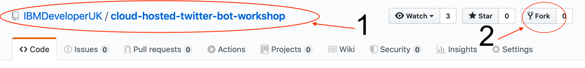

# Lab 1 - Creating a basic Golang Application :books:

In this very first Lab you will clone the repository of the project to make the setup slightly easier and ensure you can run a simple "Hello world" program.

### Step 1

1. Fork this repository and then clone your personal copy into `$HOME/<user>/go/github.com` on your machine.

2. Open the project directory into your preferred editor. (I use [Visual Studio Code](https://code.visualstudio.com/) with the recommended [Go extension](https://code.visualstudio.com/docs/languages/go) installed from the marketplace).
3. You will be using the Go Modules to manage imports in this workshop so in the terminal, navigate into the project directory and initialise it. To do this enter the follow commands:

```bash
go mod init
```
```bash
go mod tidy
```

### Step 2

Lets start by making a simple `Hello-World` program.

Open the `main.go` file, located in the `cmd` folder and add the code below:

```golang
package main

import "fmt"

func main() {
    fmt.Println("Hello Fellow Gopher")
}
```

Save the file and then run it. To do this, navigate to the directory in a new terminal window and use the command `go run cmd/main.go`. This will compile the code and run the program without building a binary (more on this later). The output in the terminal should be `Hello Fellow Gopher!`.

In the next lab we will turn this up a notch and turn your simple `hello world` program into a web server.

Onto [Lab 2](./lab-2.md)
