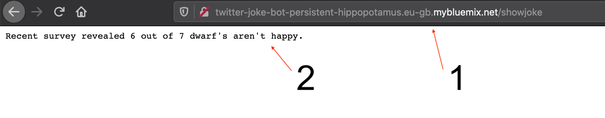

# Lab 3 - Up in the :cloud:

In this lab you will deploy your application into a cloud environment. Because of its simplicity and ease, this lab will show you how to do this in IBM Cloud Foundary. 

Before you can complete any of the next steps, you must either [sign up](https://cloud.ibm.com/registration) for an IBM Cloud account or make sure you are [logged into](https://cloud.ibm.com/login) your existing one.

## IBM Cloud Foundary deployment

### Step 1

Install the [ibmcloud cli tool](https://cloud.ibm.com/docs/cli?topic=cloud-cli-install-ibmcloud-cli#shell_install) with the following commands. With this you can access IBM Cloud from your command-line with the prefix `ibmcloud`.

Mac

```bash
curl -fsSL https://clis.cloud.ibm.com/install/osx | sh
```

Linux

```bash
curl -fsSL https://clis.cloud.ibm.com/install/linux | sh
```

Windows Powershell

```bash
iex(New-Object Net.WebClient).DownloadString('https://clis.cloud.ibm.com/install/powershell')
```

> **Note**: If you encounter errors like `The underlying connection was closed: An unexpected error occurred on a send`, make sure you have .Net Framework 4.5 or later installed. Also try to enable TLS 1.2 protocol by running the following command:

```bash
[Net.ServicePointManager]::SecurityProtocol = [Net.SecurityProtocolType]::Tls12
```

## Step 2

First you need to prepare your application for Cloud Foundary. To do this, in the root directory of your project you will find a file called `manifest.yml`. This will be the building blocks for your application when pushing it up to the cloud. Inside this file add the following code. **Be sure to change the commented code!**

```yaml
---
applications:
- name: <name of your app as it appears in IBM Cloud> e.g Twitter-Joke-Bot
  random-route: true
  memory: 128M
  env:
    GO_INSTALL_PACKAGE_SPEC: <path to your main.go file on your system> e.g github.com/cloud-hosted-twitter-bot-workshop/cmd
```

## Step 3

In a terminal window, from within your project directory \(`/go/src/github.com/<projectname>`\), you are going to login to your IBM Cloud account, target Cloud Foundary and then push your application up. To do this, follow the simple steps that follow:

1. Make sure you are logged into IBM Cloud via the CLI: `ibmcloud login`

> **Note**: If you have a federated ID, use `ibmcloud login --sso` to log in to the IBM Cloud CLI. Enter your user name, and use the provided URL in your CLI output to retrieve your one-time passcode. You know you have a federated ID when the login fails without the --sso and succeeds with the --sso option.

2. Enter your IBM Cloud credentials when prompted
3. Target Cloud Foundary with IBM Cloud by using: `ibmcloud target --cf`
4. Push your app into Cloud Foundary: `ibmcloud cf push`

If the push is successful, your application will be created and you should see the following output (or something very similar) :clap:

```bash
Waiting for app to start...

name:              Twitter-Joke-Bot
requested state:   started
routes:            twitter-joke-bot-persistent-hippopotamus.eu-gb.mybluemix.net
last uploaded:     Thu 14 May 10:30:50 BST 2020
stack:             cflinuxfs3
buildpacks:        go

type:            web
instances:       1/1
memory usage:    128M
start command:   ./bin/cmd
     state     since                  cpu    memory      disk      details
#0   running   2020-05-14T09:31:04Z   0.0%   0 of 128M   0 of 1G   
```

To see your application running and have it output a joke, copy and paste the `routes` value from your output into a browser address bar and append `/showjoke` onto the end of it. 

Example: `twitter-joke-bot-persistent-hippopotamus.eu-gb.mybluemix.net/showjoke`



The next stage of this workshop will be turning this web app into a twitter bot, continue onto [Lab 4](./lab-4.md)