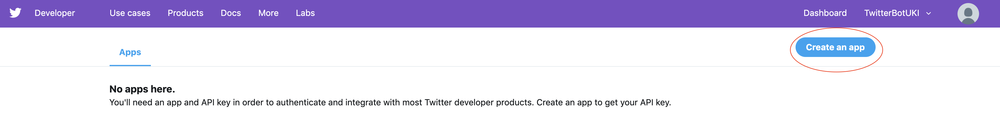
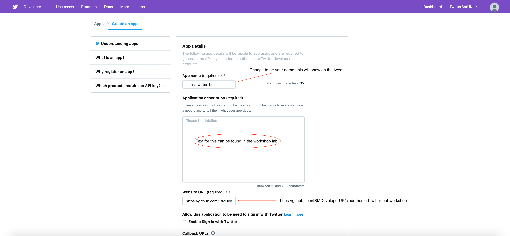
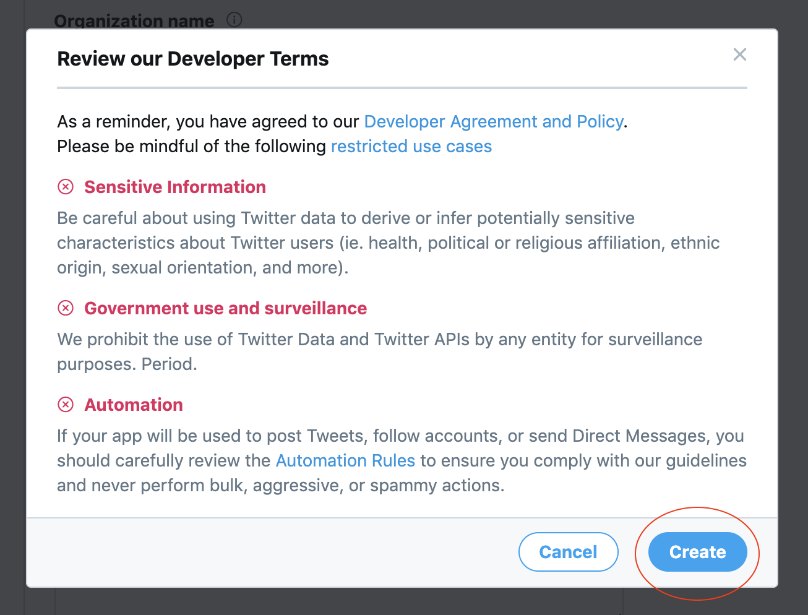
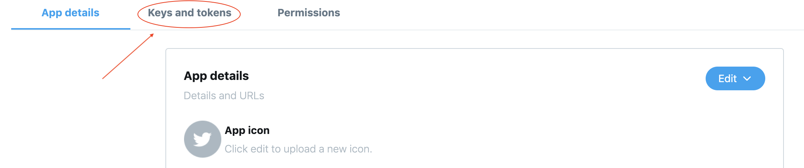
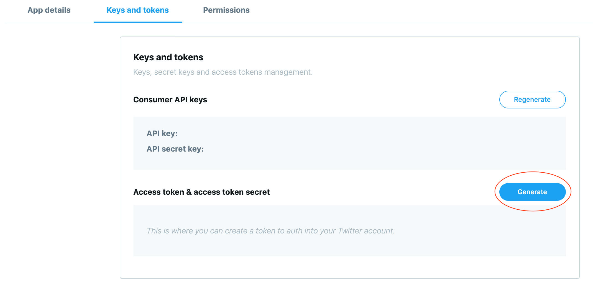

# Lab 4 - Tweet Tweet! :bird:

In this lab, you will look at transforming the web app into a twitter bot. To complete this, you must have a twitter developer account set up with the API keys to hand.

### Step 1

If you haven't already, please send over your twitter handle and accept the email invitation sent to the email address on your twitter account.

Go to the [Twitter Developer Dashboard](https://developer.twitter.com/en/apps) and create an app. This will become your instance of the twitter bot and will give you access to the API keys. To do this, click on the link and follow these simple steps:

Create a new app



Fill in the forms required fields using the following information

Website to be used: "https://github.com/IBMDeveloperUK/cloud-hosted-twitter-bot-workshop"

Application description: "An app allowing the connection of a twitter bot"



Scroll to the bottom and copy+paste this text into the usage box:

"The intention of this new app is to connect a Golang Twitter bot through the Twitter API. This is part of a Golang workshop being run by the IBM Developer UKI team."


Accept the T&Cs



Once created, navigate to the "Keys and token" tab



You will see your public keys (the screenshot ones below have been blanked out) and you will need to generate your private keys by clicking on "Generate" **MAKE A NOTE OF THESE**



### Step 2

Now you have created an app in Twitter, lets code the server :beers:

1. Create a new folder called `pkg` in your root directory of your project
2. Inside this folder create another new folder and call it `twitter_auth`
3. Inside your `twitter_auth` directory, create a file called `twitter_auth.go`
4. The first thing you need to do is authenticate with twitter and connect to the app you created. To do this, read and add the following code to this file:

```go
package twitter_auth

import (
    "os"

    "github.com/dghubble/go-twitter/twitter"
    "github.com/dghubble/oauth1"
    logr "github.com/sirupsen/logrus"
)

// Credentials struct contains API credentials pulled from env vars:
type Credentials struct {
    ApiKey              string
    ApiSecretKey        string
    AccessToken         string
    AccessTokenSecret   string
}

func GetCredentials() Credentials {
    // Populating the struct - value semantic construction
    creds := Credentials{
        ApiKey:             os.Getenv("API_KEY"),
        ApiSecretKey:       os.Getenv("API_SECRET_KEY"),
        AccessToken:        os.Getenv("ACCESS_TOKEN"),
        AccessTokenSecret:  os.Getenv("ACCESS_TOKEN_SECRET"),
    }
    return creds
}

/* GetUserClient:
Input = credentials
Return = client, error
*/
func GetUserClient(creds *Credentials) (*twitter.Client, error) {

    // Create a new config & token using the data stored in 'creds'
    config := oauth1.NewConfig(creds.ApiKey, creds.ApiSecretKey)
    token := oauth1.NewToken(creds.AccessToken, creds.AccessTokenSecret)

    // Create a new http client
    httpClient := config.Client(oauth1.NoContext, token)
    client := twitter.NewClient(httpClient)

    verifyParams := &twitter.AccountVerifyParams{
        SkipStatus:   twitter.Bool(true),
        IncludeEmail: twitter.Bool(true),
    }

    // Verify the user credentials
    user, _, err := client.Accounts.VerifyCredentials(verifyParams)
    if err != nil {
        logr.Error(err)
        return nil, err
    }

    logr.Infof("User Account Info:\n%+v\n", user)
    return client, nil
}
```

Now that the authentication package has been created you need to call this from your `main.go` file and add another route handler. To do this start by adding a new function into your `main.go` file:

```go
// TweetHandler executes logic to tweet a joke
func TweetHandler(w http.ResponseWriter, r *http.Request) {
    w.WriteHeader(http.StatusOK)
    dadJoke, err := getJoke()
    if err != nil {
        logr.Error(err)
        os.Exit(1)
    }
    w.Write([]byte(fmt.Sprintf("The following joke will be tweeted, %s\n", dadJoke)))

    // Get twitter credentials from the twitter_auth package
    creds := twitter_auth.GetCredentials()

    // Build client
    client, err := twitter_auth.GetUserClient(&creds)
    if err != nil {
        logr.Error("Error getting Twitter Client")
        logr.Error(err)
    }

    // Tweet the joke by calling the function within client
    tweet, resp, err := client.Statuses.Update(dadJoke, nil)
    if err != nil {
        logr.Error(err)
    }

    logr.Infof("%+v\n", resp)
    logr.Infof("%+v\n", tweet)
}
```

Once the new function has been added, in your `main()` function add the following line, just like you did before with the `jokeHandler`:

```go
http.HandleFunc("/tweetjoke", TweetHandler)
```

Because the `twitter_auth` is its own separate package you will also need to add it to your imports in your `main.go` file. This will be a relative path to the file on your machine. For example, it should look something like:

```go
"github.com/cloud-hosted-twitter-bot-workshop/pkg/twitter_auth"
```

Test it compiles by running the application locally `go run cmd/main.go` (don't attempt to hit the new route just yet as it will attempt to tweet and fail)

If it compiles successfully, terminate the application and push it up to the cloud where you are hosting it (next step).

### Step 3

Ensure everything is saved and then from your projects root directory enter the following command to re-push the application up to Cloud Foundry:

```bash
ibmcloud cf push
```

### Step 4

Once the application is in Cloud Foundry you will need to add the API keys to the environment variables - this can be completed in the CLI and it is really easy!

In your terminal window you need to run a simple command for each key:

```bash
ibmcloud cf set-env APP_NAME ENV_VAR_NAME ENV_VAR_VALUE
```

For example:

```bash
ibmcloud cf set-env Twitter-Joke-Bot API_KEY abc123
```

You will need to run this command for each of the 4 keys:

- API_KEY

- API_SECRET_KEY

- ACCESS_TOKEN

- ACCESS_TOKEN_SECRET

The values for these can be found in your app on your [Twitter Developer Dashboard](https://developer.twitter.com/en/apps) as shown in Step 1

After adding the environment variables, you _may_ be prompted to restage your application to ensure these have taken effect. To do this, run the following command:

```bash
ibmcloud cf restage <app-name>
```

Now your application has been restaged, it will have access to the environment variables, allowing it to authenticate with the Twitter API.

### Step 5

Lets try it out?

Just like in Lab 3, using your application route in a browser but this time replace `/showjoke` with `/tweetjoke`

This will tweet a random joke from the first API and you can check this by looking on your twitter feed!

### What next? Want some more? Try these next steps with less help :wink:

1. Create a route handler that will use the twitter API to search for a given key term and display the output.

2. Fancy a different deployment method? Try deploying the application into a Kubernetes cluster on IBM Cloud. (Hint: There is another workshop to assist with this - be careful with environment variables though!)

### Step 6 - Clean up

Wahoo! You've completed the exercises and we hope you have a better understanding of Go!

If you would like to clean up your application from IBM Cloud, use the following command inside your terminal:

```bash
ibmcloud cf delete <APP-NAME> -r
```

This will delete the deployed application and remove any mapped routes.


If you want to complete this lab by yourself in your own time, you can do so by applying for a personal [Twitter Developer Account](https://developer.twitter.com/en/apply-for-access) and following the same process explained in this workshop.
