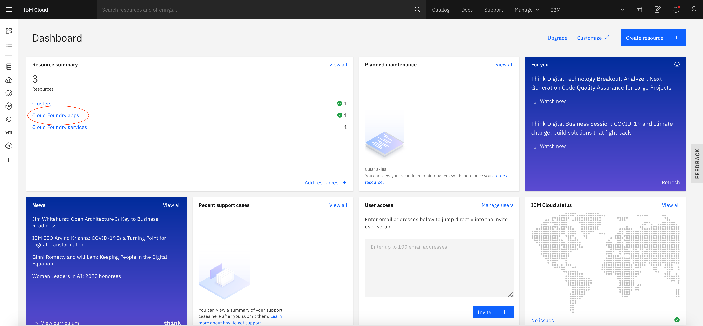
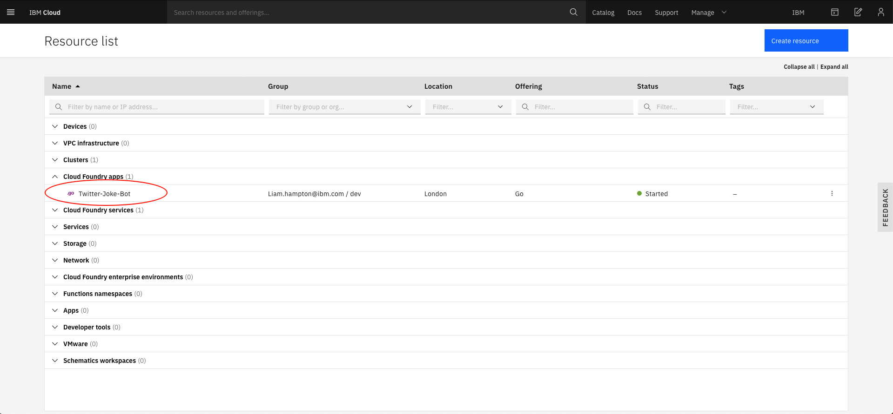
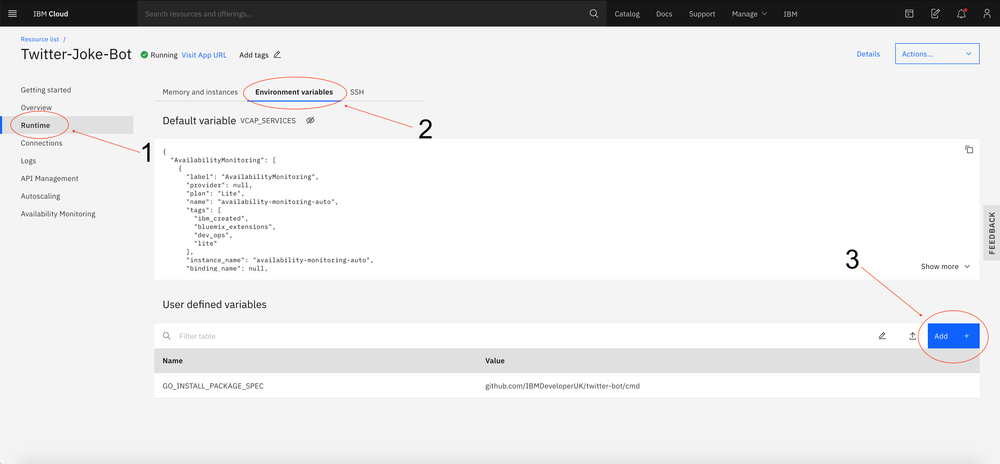
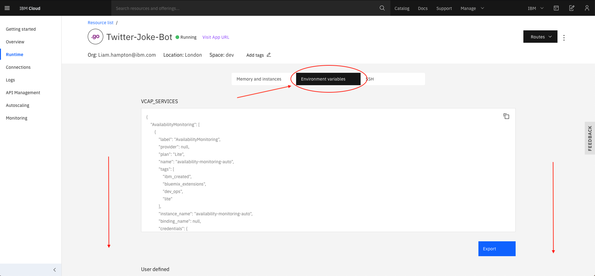
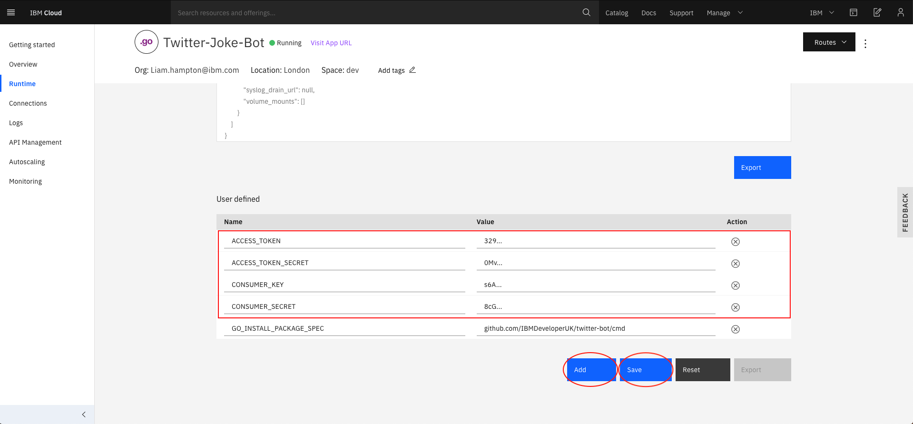

# Lab 4 - Tweet Tweet! :bird:

In this lab, you will look at transforming the web app into a twitter bot. To complete this, you must have a twitter developer account set up with the API keys to hand.

### Step 1

If you haven't already, please send over your twitter handle!

Go to the [Twitter Developer Dashboard](https://developer.twitter.com/en/apps) and create an app. This will become your instance of the twitter bot and will give you access to the API keys.

### Step 2

Now you have created an app in Twitter, lets code the server :beers:

1. Create a new folder inside your `pkg` directory and call it `twitter_auth`
2. Inside your `twitter_auth` directory create a file called `twitter_auth.go`
3. The first thing you need to do is authenticate with twitter and connect to the app you created. To do this, read and add the following code to this file:

```go
package twitterauth

import (
    "os"

    "github.com/dghubble/go-twitter/twitter"
    "github.com/dghubble/oauth1"
    logr "github.com/sirupsen/logrus"
)

// Credentials struct contains API credentials pulled from env vars:
type Credentials struct {
    ConsumerKey       string
    ConsumerSecret    string
    AccessToken       string
    AccessTokenSecret string
}

func GetCredentials() Credentials {
    creds := Credentials{
        AccessToken:       os.Getenv("ACCESS_TOKEN"),
        AccessTokenSecret: os.Getenv("ACCESS_TOKEN_SECRET"),
        ConsumerKey:       os.Getenv("CONSUMER_KEY"),
        ConsumerSecret:    os.Getenv("CONSUMER_SECRET"),
    }
    return creds
}

/* GetUserClient:
Input = credentials
Return = authenticated twitter client, error
*/
func GetUserClient(creds *Credentials) (*twitter.Client, error) {

    config := oauth1.NewConfig(creds.ConsumerKey, creds.ConsumerSecret)
    token := oauth1.NewToken(creds.AccessToken, creds.AccessTokenSecret)

    httpClient := config.Client(oauth1.NoContext, token)
    client := twitter.NewClient(httpClient)

    verifyParams := &twitter.AccountVerifyParams{
        SkipStatus:   twitter.Bool(true),
        IncludeEmail: twitter.Bool(true),
    }

    user, _, err := client.Accounts.VerifyCredentials(verifyParams)
    if err != nil {
        logr.Error(err)
        return nil, err
    }

    logr.Infof("User Account Info:\n%+v\n", user)
    return client, nil
}
```

Now that the authentication package has been created you need to call this from your `main.go` file and add another route handler. To do this start by adding a new function into your `main.go` file:

```go
func TweetHandler(w http.ResponseWriter, r *http.Request) {
    w.WriteHeader(http.StatusOK)
    dadJoke, err := getJoke()
    if err != nil {
        logr.Error(err)
        os.Exit(1)
    }
    w.Write([]byte(fmt.Sprintf("The following joke will be tweeted, %s\n", dadJoke)))

    creds := twitter_auth.GetCredentials()

    client, err := twitter_auth.GetUserClient(&creds)
    if err != nil {
        logr.Error("Error getting Twitter Client")
        logr.Error(err)
    }

    tweet, resp, err := client.Statuses.Update("Todays dad joke is: "+dadJoke, nil)
    if err != nil {
        logr.Error(err)
    }

    logr.Infof("%+v\n", resp)
    logr.Infof("%+v\n", tweet)
}
```

Once the new function has been added, in your `main()` function add the following line, just like you did before with the `jokeHandler`:

```go
r.HandleFunc("/tweetjoke", TweetHandler)
```

Because the `twitter_auth` is within its own package you will also need to add it to your imports. This will be a relative path to the file on your machine. For example:

```go
twitter_auth "github.com/IBMDeveloperUK/twitter-bot-ws/pkg/twitter_auth"
```

> **Note**: It is important to keep the `twitter_auth`prefix to prevent it interfering with other declarations of the twitter API package within the code

1. Test it compiles by running the application locally `go run cmd/main.go` (don't attempt to hit the new route just yet as it will attempt to tweet and fail)
2. If it compiles successfully, push it up to the cloud where you are hosting it.

### Step 3

Ensure everything is saved and then from your projects root directory enter the following command to re-push the application up to Cloud Foundary:

```bash
ibmcloud cf push
```

### Step 4

Once the application is in Cloud Foundary you will need to add the API keys to the environment variables - this can be completed in the UI and it is really easy!

On your IBM Cloud dashboard navigate to your Cloud Foundary apps and click on it



This will take you to your resources list. Click on your twitter-bot resource



Once within your application, go to the runtime section which can be found in the left side menu



Click on the heading `Environment variables`



Scroll down to the application variables, add your `ACCESS_TOKEN`, `ACCESS_TOKEN_SECRET`, `CONSUMER_KEY`, `CONSUMER_SECRET` from Twitter and save the configuration. These can be found in your [Twitter Developer Dashboard](https://developer.twitter.com/en/apps)



Now these have been saved, your application will have access to them. Lets try it out?

Click on the "Visit App URL" and append `/tweetjoke` to the end of the URL. This will tweet a random joke and you can check this by looking on your twitter feed!

### Finished? Feeling brave and want some more? Try these next step with less help :wink:

1. Create a route handler that will search for a given key term and display the output.

2. Fancy a different deployment method? Try deploying the application into a Kubernetes cluster on IBM Cloud. (Hint: There is another workshop to assist with this - be careful with environment variables though!)

